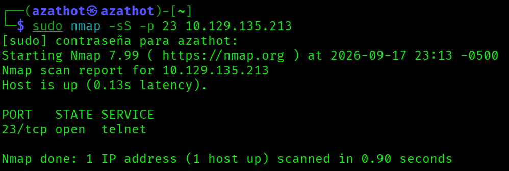
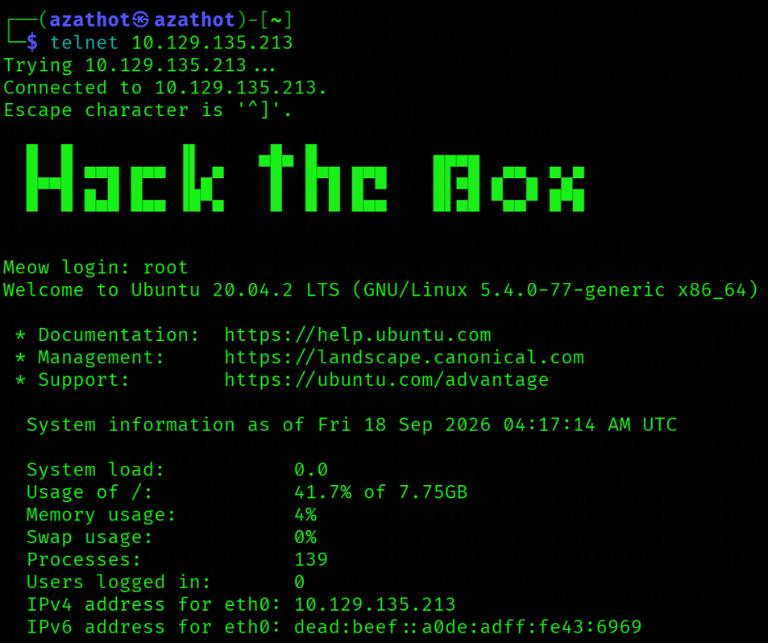
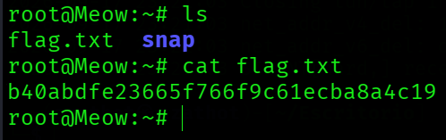

  

---

# Acerca de
Dancing es una máquina Windows muy fácil que introduce el protocolo Server Message Block (SMB), su enumeración y su explotación cuando está mal configurado para permitir acceso sin contraseña.
* Very Easy
* Windows

---

# Preguntas

## Tarea 01

**¿Qué significan las siglas de 3 letras SMB?**

**Respuesta:** `Server Message Block`

## Tarea 02

**¿Qué puerto usa SMB para operar?**

**Respuesta:** `445`

## Tarea 03

**¿Cuál es el nombre del servicio para el puerto 445 que apareció en nuestro escaneo de Nmap?**

**Respuesta:** `microsoft-ds`

## Tarea 04

**¿Qué herramienta usamos para probar nuestra conexión al objetivo con una solicitud de eco ICMP?**

**Respuesta:** `ping`

## Tarea 05

**¿Cuál es el nombre de la herramienta más común para encontrar puertos abiertos en un objetivo?**

**Respuesta:** `nmap`

## Tarea 06

**¿Qué servicio identificamos en el puerto 23/tcp durante nuestros escaneos?**

**Respuesta:** `telnet`

## Tarea 07

**¿Qué nombre de usuario puede iniciar sesión en el objetivo a través de telnet con una contraseña en blanco?**

**Respuesta:** `root`

## Envía la flag ubicada en el directorio home de root

**Respuesta:** `b40abdfe23665f766f9c61ecba8a4c19`
