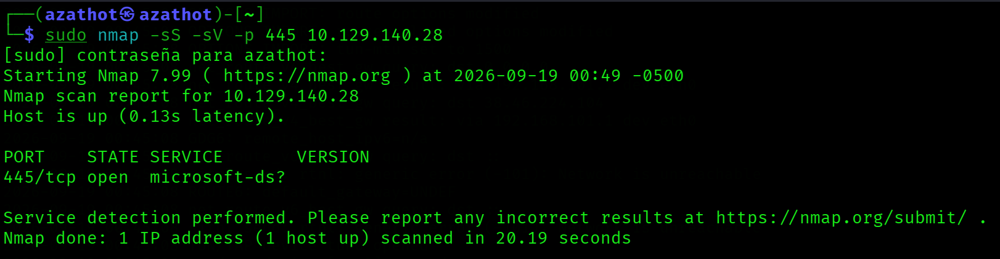
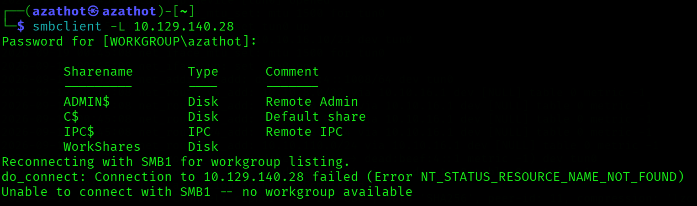
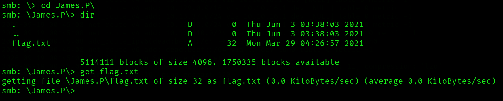
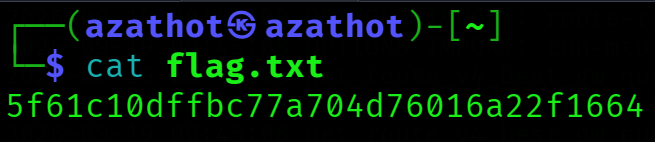

  

---

# Acerca de
Dancing es una máquina Windows muy fácil que introduce el protocolo Server Message Block (SMB), su enumeración y su explotación cuando está mal configurado para permitir acceso sin contraseña.
* Very Easy
* Windows

---

# Preguntas

## Tarea 01

**¿Qué significan las siglas de 3 letras SMB?**

**Respuesta:** `Server Message Block`

## Tarea 02

**¿Qué puerto usa SMB para operar?**

**Respuesta:** `445`

## Tarea 03

**¿Cuál es el nombre del servicio para el puerto 445 que apareció en nuestro escaneo de Nmap?**

**Respuesta:** `microsoft-ds`

## Tarea 04

**¿Cuál es la 'flag' o 'switch' que podemos usar con la utilidad smbclient para 'listar' los recursos compartidos SMB disponibles en Dancing?**

**Respuesta:** `-L`

## Tarea 05

**¿Cuántos recursos compartidos hay en Dancing?**

**Respuesta:** `4`

## Tarea 06

**¿Cuál es el nombre del recurso compartido al que finalmente podemos acceder con una contraseña en blanco?**

**Respuesta:** `WorkShares`

## Tarea 07

**¿Cuál es el comando que podemos usar dentro del shell de SMB para descargar los archivos que encontramos?**

**Respuesta:** `get`

## Envía la flag ubicada en el recurso compartido SMB

**Respuesta:** `5f61c10dffbc77a704d76016a22f1664`
