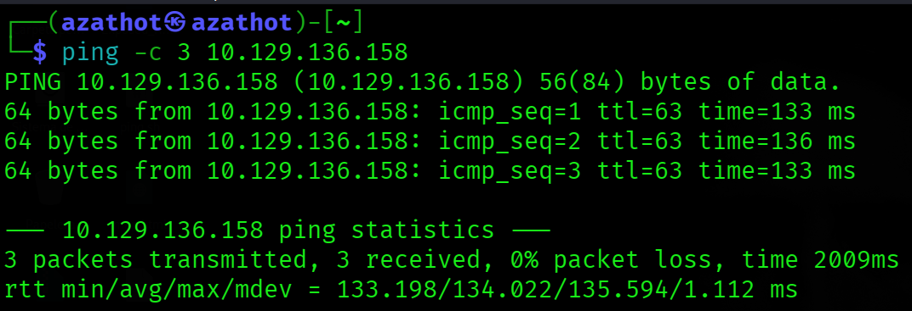
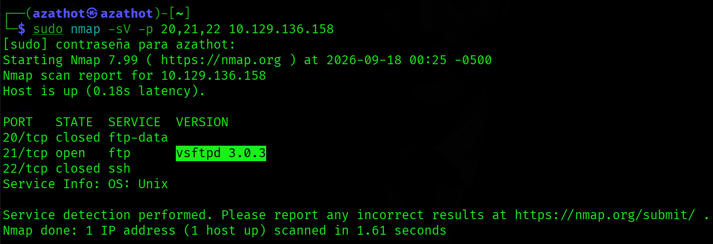
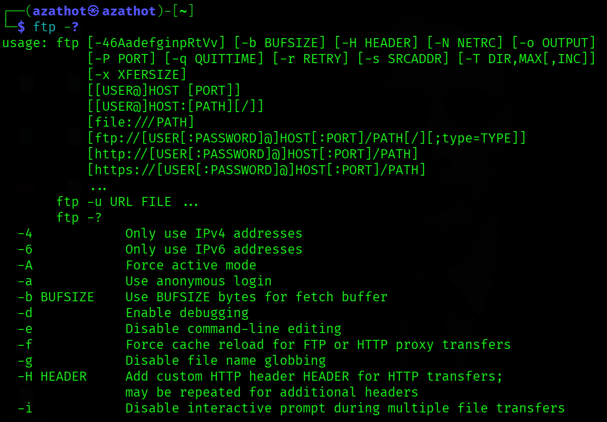
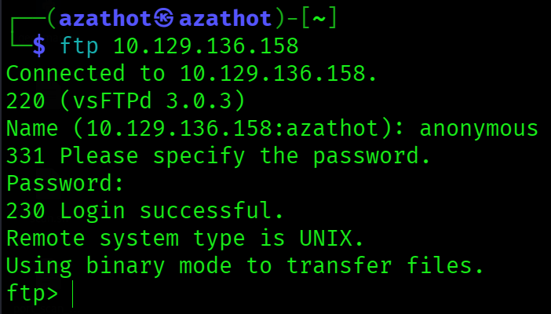
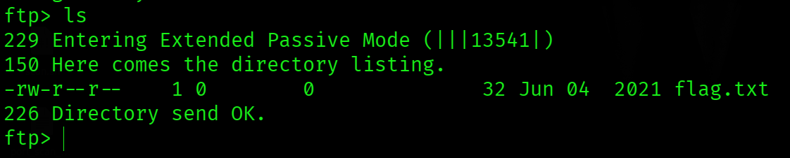
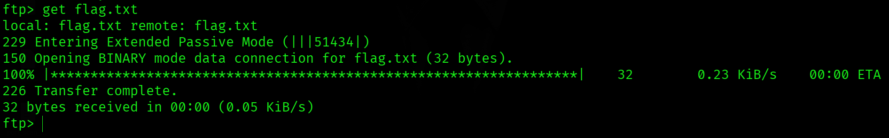
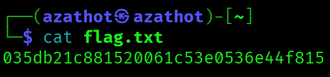

  

---

# Acerca de
Fawn es una máquina Linux muy fácil que explora el Protocolo de Transferencia de Archivos (FTP) y su explotación cuando está mal configurado para permitir acceso anónimo.
* Very Easy
* Linux

---

# Preguntas

## Tarea 01

**¿Qué significan las siglas de 3 letras FTP?**

**Respuesta:** `File Transfer Protocol`

## Tarea 02

**¿En qué puerto suele escuchar el servicio FTP?**

**Respuesta:** `21`

## Tarea 03

**FTP envía datos en texto plano, sin ningún cifrado. ¿Qué acrónimo se usa para un protocolo posterior diseñado para proporcionar una funcionalidad similar a FTP pero de forma segura, como una extensión del protocolo SSH?**

**Respuesta:** `SFTP`

## Tarea 04

**¿Cuál es el comando que podemos usar para enviar una solicitud de eco ICMP y probar nuestra conexión al objetivo?**

**Respuesta:** `ping`

## Tarea 05

**Según tus escaneos, ¿qué versión de FTP se está ejecutando en el objetivo?**

**Respuesta:** `vsftpd 3.0.3`

## Tarea 06

**Según tus escaneos, ¿qué tipo de sistema operativo se está ejecutando en el objetivo?**

**Respuesta:** `Unix`

## Tarea 07

**¿Cuál es el comando que necesitamos ejecutar para mostrar el menú de ayuda del cliente 'ftp'?**

**Respuesta:** `ftp –?`

## Tarea 08

**¿Cuál es el nombre de usuario que se usa sobre FTP cuando quieres iniciar sesión sin tener una cuenta?**

**Respuesta:** `anonymous`

## Tarea 09

**¿Cuál es el código de respuesta que recibimos para el mensaje FTP 'Login successful'?**

**Respuesta:** `230`

## Tarea 10

**Hay un par de comandos que podemos usar para listar los archivos y directorios disponibles en el servidor FTP. Uno es dir. ¿Cuál es el otro, que es una forma común de listar archivos en un sistema Linux?**

**Respuesta:** `ls`

## Tarea 11

**¿Cuál es el comando que se usa para descargar el archivo que encontramos en el servidor FTP?**

**Respuesta:** `get`

## Envía la flag ubicada en el servidor FTP

**Respuesta:** `035db21c881520061c53e0536e44f815`
