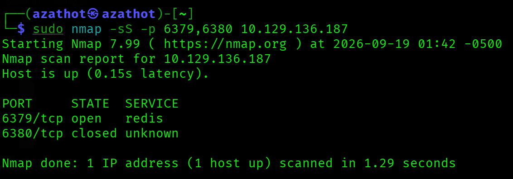
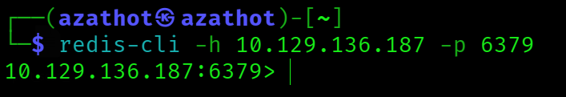
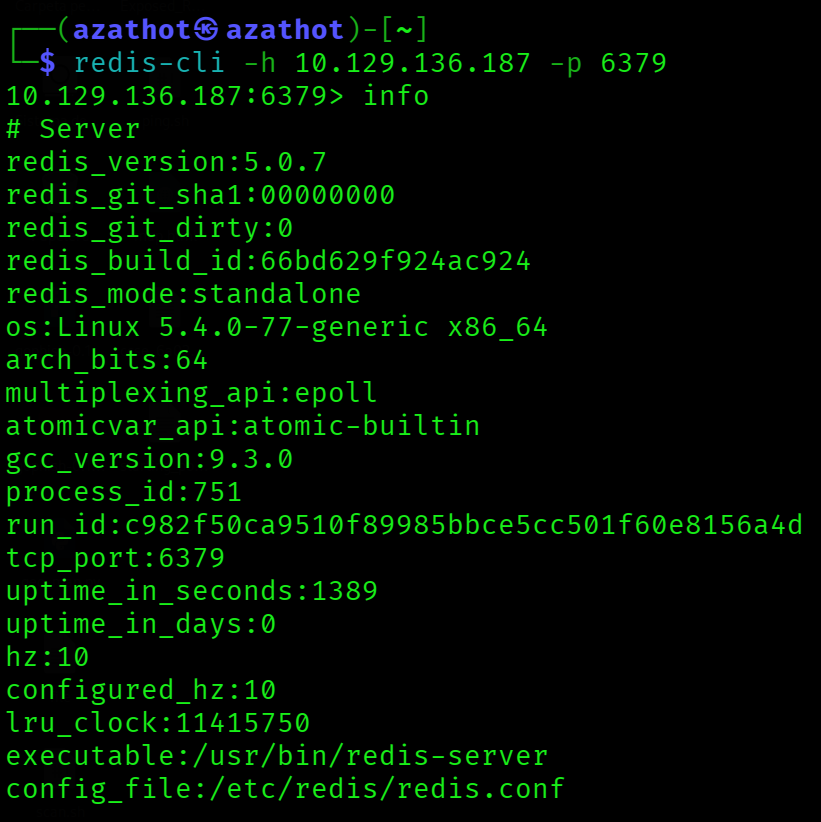
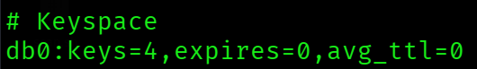
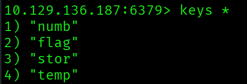
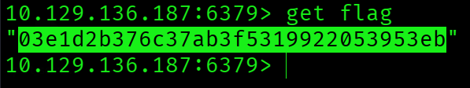

  

---

# Acerca de
Redeemer es una máquina Linux muy fácil que explora la enumeración y explotación de un servidor de base de datos Redis, a la vez que muestra la utilidad de línea de comandos redis-cli y comandos básicos para interactuar con el servicio Redis.
* Very Easy
* Linux

---

# Preguntas

## Tarea 01

**¿Qué puerto TCP está abierto en la máquina?**

**Respuesta:** `6379`

## Tarea 02

**¿Qué servicio se está ejecutando en el puerto que está abierto en la máquina?**

**Respuesta:** `redis`

## Tarea 03

**¿Qué tipo de base de datos es Redis? Elige entre las siguientes opciones: (i) Base de datos en memoria, (ii) Base de datos tradicional**

**Respuesta:** `In-memory Database`

## Tarea 04

**¿Qué utilidad de línea de comandos se usa para interactuar con el servidor Redis? Ingresa el nombre del programa que escribirías en la terminal sin ningún argumento.**

**Respuesta:** `redis-cli`

## Tarea 05

**¿Qué flag se usa con la utilidad de línea de comandos de Redis para especificar el nombre de host?**

**Respuesta:** `-h`

## Tarea 06

**Una vez conectado a un servidor Redis, ¿qué comando se usa para obtener la información y estadísticas sobre el servidor Redis?**

**Respuesta:** `info`

## Tarea 07

**¿Cuál es la versión del servidor Redis que se está usando en la máquina objetivo?**

**Respuesta:** `5.0.7`

## Tarea 08

**¿Qué comando se usa para seleccionar la base de datos deseada en Redis?**

**Respuesta:** `select`

## Tarea 09

**¿Cuántas claves hay dentro de la base de datos con índice 0?**

**Respuesta:** `4`

## Tarea 10

**¿Qué comando se usa para obtener todas las claves en una base de datos?**

**Respuesta:** `keys *`

## Envía la flag ubicada en la base de datos

**Respuesta:** `03e1d2b376c37ab3f5319922053953eb`
